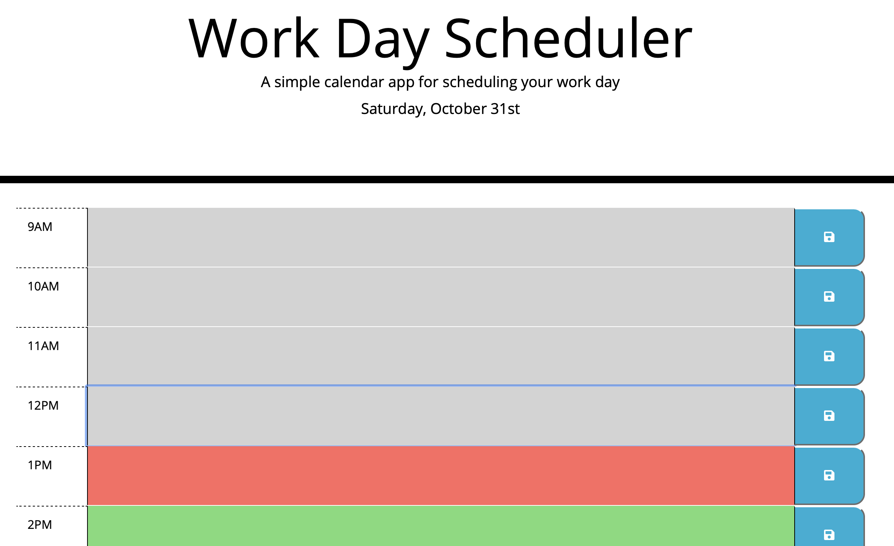

<!-- PROJECT LOGO -->
<br />
<p align="center">
  <a href="https://github.com/Calterat/Portfolio">
    
  </a>

  <h1 align="center">My Work Day Scheduler</h1>

  <p align="center">
    Julian Gillis' Work Day Schedule
    <br />
    <a href="https://github.com/Calterat/work-day-scheduler"><strong>Explore the docs »</strong></a>
    <br />
    <br />
    <a href="https://calterat.github.io/work-day-scheduler">View Demo</a>
  </p>
</p>
<br/>

<!-- TABLE OF CONTENTS -->
## Table of Contents

* [About the Project](#about-the-project)
  * [Built With](#built-with)
* [Getting Started](#getting-started)
  * [Prerequisites](#prerequisites)
  * [Installation](#installation)
* [Usage](#usage)
* [Roadmap](#roadmap)
* [Contributing](#contributing)
* [License](#license)
* [Contact](#contact)
* [Acknowledgements](#acknowledgements)


<!-- ABOUT THE PROJECT -->
## About The Project



Here's a quick screenshot of the word day scheduler page.

Under the hood of this webpage is my JavaScript code using Third-Party APIs like jQuery and Moment.js. This displays some of my abilities with JavaScript. You may enter your tasks at anytime slot, but don't forget to save! The save button just to the right of each task field will save only that task, so if you change another field without saving, don't expect another tasks save button to save those other tasks. The data persists in your localStorage, so if you leave and come back it will still be there.

This was a challenge as the third-party apps were new concepts, and the CSS was provided. Sometimes going through the existing code to figure out how you are suppose to use existing declarations is tough. I suppose I now understand the limitations of libraries and frameworks because you think about how you can shape your program according to what is provided rather than working from the ground up (which could take way too long depending on the size of the program) Challanges I faced on this project was the use of Java to dynamically create the HTML for display, how to assign saved tasks to localStorage, and how to retrieve them.

These are the learned tools in JavaSCript that I used to accomplish the this project:
 - Variables
 - Arrays
 - Objects
 - while and for loops
 - if/else conditional statements
 - functions
 - The DOM and other Web APIs
 - Third-Party APIs like jQeary and Moment.js


### Built With

* [HTML]()
* [CSS]()
* [JavaScript]()
* [jQuery]()
* [Bootstrap]()
* [FontAwesome]()
* [Moment.js]()
* [Google Fonts]()
* [VSCODE]()
* [GIT]()


<!-- GETTING STARTED -->
## Getting Started

To get a local copy of the source code these simple steps.

### Prerequisites

These are the tools you'll need if locally editing the source code.
* Git Bash (if using Windows)
    * https://gitforwindows.org (for Windows)
* Terminal (built into MacOS)
* VSCode or comparible text/code editor
    * https://code.visualstudio.com

### Cloning

1. Clone the repo (type in Bash or Terminal)
```
git clone git@github.com:Calterat/work-day-scheduler.git
```


<!-- USAGE EXAMPLES -->
## Usage

[My Portfolio](https://calterat.github.io/work-day-scheduler)

Please press the 'Generate Button' and use it to produce a random password using the character types you selected.


<!-- ROADMAP -->
## Roadmap

See the [open issues](https://github.com/Calterat/work-day-scheduler/issues) for a list of proposed features (and known issues).


<!-- Suggestions -->
## Suggestions

Suggestions are welcomed. I love to learn, to create, and be inspired. Any suggestions/features you suggest are **greatly appreciated**.

1. Fork the Project
2. Create your Feature Branch (`git checkout -b feature/suggestions`)
3. Commit your Changes (`git commit -m 'Created Suggestion'`)
4. Push to the Branch (`git push origin feature/suggestions`)
5. Open a Pull Request


<!-- LICENSE -->
## License

Distributed under the MIT License. See `LICENSE` for more information.


<!-- CONTACT -->
## Contact

Julian Gillis -  Calterat@gmail.com

Project Link: [https://github.com/Calterat/work-day-scheduler](https://github.com/Calterat/work-day-scheduler)


<!-- Additional Notes -->
## Additional Notes

Thank you for taking the time to check out and use my random password generator!


<!-- ACKNOWLEDGEMENTS -->
## Acknowledgements

* [All instructors who helped with my teachings]()
* [Othneil Drew](#https://github.com/othneildrew)
    * How to - README.md templates
* [coding-boot-camp](#https://github.com/coding-boot-camp)
    * Initial HTML, CSS, and JavaScript Code


<!-- MARKDOWN LINKS & IMAGES -->
<!--

[GitHub Repository]: https://github.com/Calterat/work-day-scheduler
[Password Generator URL]: https://calterat.github.io/work-day-scheduler
[issues-url]: https://github.com/Calterat/work-day-scheduler/issues
[license-url]: https://github.com/Calterat/work-day-scheduler/blob/master/LICENSE.txt
[linkedin-url]: https://www.linkedin.com/in/julian-gillis-5ba18b20/


-->